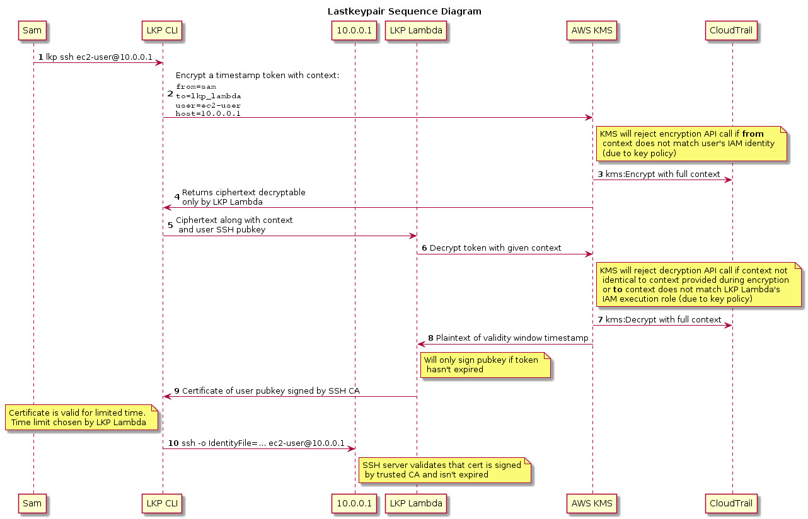

# `lastkeypair`

**NOTE: README is a work-in-progress**

## Preamble

`lastkeypair` was borne out of a frustration with the proliferation of SSH
key-pairs that is all too common across large AWS deployments. These are the 
normal sort of pains: 

* Developers freely create new keys because they don't have access to existing 
  keys. These are only stored on their dev laptops and maybe shared with others
  on an ad-hoc basis.
* Golden keys are centrally administered by a benevolent ops teams that does a 
  decent job of key-rotation, key-sharing and so on. Keys need to be immediately 
  replaced when an employee leaves.
* Every developer has their own key and all keys are distributed to all 
  instances - maybe as a boot job and on an hourly basis thereafter.
* People decide all the above options are awful and resort to some kind of LDAP
  module wherein `sshd` on instances makes a call back to a central login 
  server - better hope that server is up and there is connectivity at 2AM when
  a system is on fire.
  
OpenSSH has a long-supported but woefully under-utilised certificate 
functionality. This is conceptually _similar_ to X509 (i.e. "SSL certs"), but
SSH-specific. `lastkeypair` aims to be a plug-and-play solution based on SSH 
certificates, AWS Lambda and AWS KMS.

## Setup

## How it works

## Alternatives

* [BLESS](https://github.com/netflix/bless)
* [python-blessclient](https://github.com/lyft/python-blessclient)
* [sshephalopod](https://github.com/realestate-com-au/sshephalopod/)
* [ssh-cert-authority](https://github.com/cloudtools/ssh-cert-authority)
* [pam-ussh](https://github.com/uber/pam-ussh)
* [facebook-doc](https://code.facebook.com/posts/365787980419535/scalable-and-secure-access-with-ssh/)

